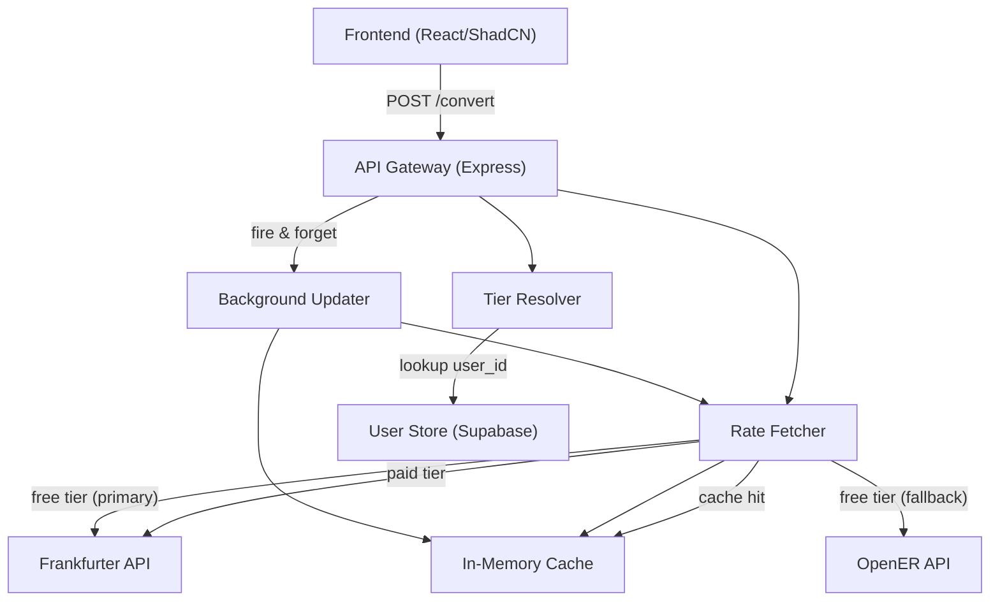

# Design Document: Forex Rates Service

## Overview

The forex rates service is a full-stack application consisting of a Node.js/Express backend and a React/ShadCN frontend. It converts currency values between a supported set of currencies (USD, EUR, GBP, JPY, INR), with differentiated behavior for free-tier and paid-tier users.

Key design goals:
- Paid users receive rates from the Frankfurter premium API; free users are served via a load-balanced pool of public APIs with automatic fallback.
- A tier-aware in-memory cache reduces redundant external API calls and supports stale-while-revalidate via async background updates.
- The frontend provides a minimal demo UI for selecting a user identity and viewing live exchange rates with freshness indicators.

### Technology Stack

- **Backend**: Node.js + Express, TypeScript
- **Database**: Supabase (PostgreSQL) for user tier storage
- **External APIs**: Frankfurter API (`https://api.frankfurter.app`), OpenER API (`https://open.er-api.com`)
- **Frontend**: React + ShadCN/UI, TypeScript, Vite
- **Testing**: None required

---

## Architecture



### Request Flow

1. Client sends `POST /convert` with `user_id`, `base_currency`, `value_of_base_currency`, `target_currency`.
2. API Gateway validates inputs (required fields, supported currencies).
3. Tier Resolver queries Supabase for the user's tier (`free` or `paid`; defaults to `free` if not found).
4. Rate Fetcher checks the Cache for a non-expired entry keyed by `(base_currency, target_currency)`.
5. On cache miss, Rate Fetcher calls the appropriate external API based on tier.
6. Response is returned to the client immediately.
7. Background Updater asynchronously refreshes the cache entry without blocking the response.

---

## Components and Interfaces

### API Gateway (`src/routes/convert.ts`)

Exposes `POST /api/convert`. Orchestrates validation, tier resolution, rate fetching, and response serialization.

```typescript
// Request body
interface ConvertRequest {
  user_id: string;
  base_currency: SupportedCurrency;
  value_of_base_currency: number;
  target_currency: SupportedCurrency;
}

// Response body
interface ConvertResponse {
  converted_value: number;
  exchange_rate: number;
  source: "premium" | "free";
  premium: boolean;
  premium_fallback: boolean;
  cache_timestamp: string; // ISO 8601
}
```

### Tier Resolver (`src/services/tierResolver.ts`)

Queries Supabase for a user's tier. Returns `"free"` if the user is not found.

```typescript
type UserTier = "free" | "paid";

interface TierResolver {
  resolve(userId: string): Promise<UserTier>;
}
```

### Rate Fetcher (`src/services/rateFetcher.ts`)

Fetches exchange rates from external APIs, with cache-first logic and tier-aware routing.

```typescript
interface RateFetchResult {
  rate: number;
  source: "premium" | "free";
  premiumFallback: boolean;
  cacheTimestamp: Date;
  fromCache: boolean;
}

interface RateFetcher {
  fetch(
    baseCurrency: SupportedCurrency,
    targetCurrency: SupportedCurrency,
    tier: UserTier
  ): Promise<RateFetchResult>;
}
```

### Cache (`src/services/cache.ts`)

In-memory cache keyed by `(base_currency, target_currency)`. Tier-aware expiry: 5 minutes for premium entries, less than 5 minutes (e.g., 3 minutes) for free entries. Premium entries overwrite free entries for the same key.

```typescript
interface CacheEntry {
  rate: number;
  source: "premium" | "free";
  timestamp: Date;
  expiresAt: Date;
}

interface RateCache {
  get(base: SupportedCurrency, target: SupportedCurrency): CacheEntry | null;
  set(base: SupportedCurrency, target: SupportedCurrency, entry: CacheEntry): void;
}
```

### Background Updater (`src/services/backgroundUpdater.ts`)

Fires asynchronously after a response is sent. Calls Rate Fetcher to refresh the cache entry. Errors are logged and do not affect the existing cache entry.

```typescript
interface BackgroundUpdater {
  scheduleRefresh(
    base: SupportedCurrency,
    target: SupportedCurrency,
    tier: UserTier
  ): void; // fire-and-forget
}
```

### External API Adapters

Two adapters normalize external API responses into a common `ExchangeRateData` shape:

```typescript
interface ExchangeRateData {
  rate: number;
  baseCurrency: SupportedCurrency;
  targetCurrency: SupportedCurrency;
  retrievedAt: Date;
}

interface ExternalApiAdapter {
  fetchRate(
    base: SupportedCurrency,
    target: SupportedCurrency
  ): Promise<ExchangeRateData>;
}
```

- **FrankfurterAdapter**: calls `https://api.frankfurter.app/latest?from={base}&to={target}`
- **OpenERAdapter**: calls `https://open.er-api.com/v6/latest/{base}`, extracts target rate from `rates` map

### Frontend Components

- **UserSelector**: Dropdown to choose between hardcoded free-tier and paid-tier user IDs.
- **RateTable**: Displays all currency pair rates for the selected user, with freshness indicators and premium badges.
- **FreshnessIndicator**: Shows age of rate data in seconds/minutes; updates every 30 seconds; renders in a distinct state when stale.

---

## Data Models

### Supabase: `users` Table

| Column    | Type    | Notes                        |
|-----------|---------|------------------------------|
| user_id   | text    | Primary key                  |
| tier      | text    | `'free'` or `'paid'`         |

### Supported Currencies

```typescript
const SUPPORTED_CURRENCIES = ["USD", "EUR", "GBP", "JPY", "INR"] as const;
type SupportedCurrency = typeof SUPPORTED_CURRENCIES[number];
```

### Cache Key

```typescript
type CacheKey = `${SupportedCurrency}:${SupportedCurrency}`;
// e.g., "USD:EUR"
```

### ExchangeRateData (internal)

```typescript
interface ExchangeRateData {
  rate: number;           // numeric conversion factor
  baseCurrency: SupportedCurrency;
  targetCurrency: SupportedCurrency;
  retrievedAt: Date;      // when the rate was fetched from the external API
}
```

### CacheEntry (internal)

```typescript
interface CacheEntry {
  rate: number;
  source: "premium" | "free";
  timestamp: Date;        // when the entry was stored
  expiresAt: Date;        // timestamp + tier-specific TTL
}
```

### ConvertResponse (API contract)

```typescript
interface ConvertResponse {
  converted_value: number;
  exchange_rate: number;
  source: "premium" | "free";
  premium: boolean;
  premium_fallback: boolean;
  cache_timestamp: string; // ISO 8601 string of CacheEntry.timestamp
}
```

---

## Error Handling

### Input Validation Errors

| Condition | HTTP Status | Response |
|-----------|-------------|----------|
| Missing required field | 422 | `{ "error": "Missing required field: {field_name}" }` |
| Malformed field (e.g., non-numeric value) | 422 | `{ "error": "Invalid value for field: {field_name}" }` |
| Unsupported currency | 400 | `{ "error": "Unsupported currency: {currency}. Supported: USD, EUR, GBP, JPY, INR" }` |

### External API Errors

| Condition | Behavior |
|-----------|----------|
| Premium API network error or non-2xx | Log error, fall back to Free_API_Pool, set `premium_fallback: true` |
| Primary Free API error | Log error, try fallback Free API |
| All Free APIs unavailable | Return HTTP 503: `{ "error": "Exchange rate service temporarily unavailable" }` |
| Malformed API response | Log error, treat as API failure, proceed to next source |

### Background Updater Errors

If the background refresh fails, the error is logged (structured log with `level: "error"`, `component: "BackgroundUpdater"`, `currencyPair`, and `error` fields) and the existing Cache_Entry is left unchanged. The error must not propagate to the HTTP response layer.

### Supabase / User Store Errors

If the Supabase query fails (network error, timeout), the system defaults the user to free-tier and logs the error. This ensures availability even when the database is temporarily unreachable.

---
